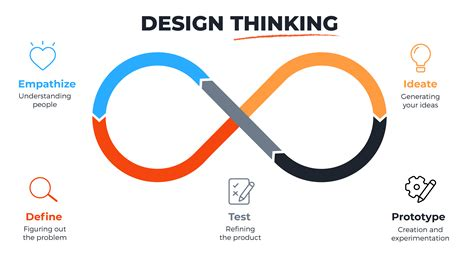

# UX/UI Design

Computers run code, developers maintain it, and humans use it. This module
focuses on the humans who use it and the developers who maintain it.

You will learn about _Design Thinking_ and _User Empathy_ by designing a home
page for one of your classmates that they will develop. The main objective is to
understand your classmate and help them to build the home page they need. Along
the way you will explore the world of Open Source Software by contributing to
your classmates home pages.

---

## Learning Objectives

Priorities: 🥚, 🐣, 🐥, 🐔 (click to learn more)

 

There is a lot to learn in this repository. If you can't master all the material
at once, that's expected! Anything you don't master now will always be waiting
for you to review when you need it. These 4 emoji's will help you prioritize
your study time and to measure your progress:

- 🥚: Understanding this material is required, it covers the base skills you'll
  need for this module and the next. You do not need to finish all of them but
  should feel comfortable that you could with enough time.
- 🐣: You have started all of these exercises and feel you could complete them
  all if you just had more time. It may not be easy for you but with effort you
  can make it through.
- 🐥: You have studied the examples and started some exercises if you had time.
  You should have a big-picture understanding of these concepts/skills, but may
  not be confident completing the exercises.
- 🐔: These concepts or skills are not necessary but are related to this module.
  If you are finished with 🥚, 🐣 and 🐥 you can use the 🐔 exercises to push
  yourself without getting distracted from the module's main objectives.

---

### [1. Design Thinking](./1-design-thinking)

- [ ] 🥚 **User Empathy**: You understand what user empathy is, and can use it
      to understand a classmate's needs and help them plan a home page.
- [ ] 🥚 **Design Cycle**: You will be able to describe the design cycle and
      what steps you will take in each state (Empathize, define, ideate,
      prototype, testing and implement).
- [ ] 🥚 **Double Diamond**: You can separate the design and deliver phases of a
      project. Design and delivery are a never-ending cycle, but it helps to be
      clear when you are focusing one or the other.
- [ ] 🥚 **Stakeholder Interviews**: You can interview another student to learn
      their motivations, needs, and blocks
- [ ] 🥚 **Rapid Prototyping**: You can use rapid prototyping techniques (such
      as paper prototyping) to test initial design hypotheses and receive user
      feedback.
- [ ] 🥚 **User Journeys**: You can write user journeys for websites that you
      use.

### [2. Gestalt Principles](./2-gestalt-principles)

- [ ] 🥚 **Design Principles**: You can apply some of the key design principles
      to your own site, such as alignment, proximity, contrast, balance and
      space.
- [ ] 🐣 **CSS**: You can use CSS3 to implement responsive & accessible designs.

### [3. Collaborative Design Softwares](./3-collaborative-design-softwares)

- [ ] 🥚 **Figma**: You can create, share and collaborate on a website design
      using Figma.

### [4. Accessibility](./4-accessibility)

- [ ] 🥚 **Accessible Design**: You will be able to make a website design more
      accessible.
- [ ] 🐣 **Screen Readers**: You can navigate a web page using a screen reader,
      and can use _semantic elements_ and _ARIA labels_ to make your web pages
      accessible.

[TOP](#ux-ui-design)

---

## Study Tips

expand/collapse

 

- Don't rush, understand! Programming is hard.
  - The examples and exercises will still be there to study later.
  - It's better to fail tests slowly and learn from your mistakes than to pass
    tests quickly and not understand why.
- Don't skip the examples! Understanding and experimenting with working code is
  a very effective way to learn programming.
- Write lots of comments in the examples and exercises. The code in this
  repository is yours to study, modify and re-use in projects.
- Practice
  [Pair Programming](https://home.hackyourfuture.be/students/study-tips/pair-programming):
  two people, one computer.
- Take a look through the
  [Learning From Code](https://home.hackyourfuture.be/students/study-tips/learning-from-code)
  guide for more study tips

### Study Board

Creating a project board on your GitHub account for tracking your study at HYF
can help you keep track of everything you're learning. You can create the board
at this link: `https://github.com/your_user_name?tab=projects`.

These 4 columns may be helpful:

- **todo**: material you have not studied yet
- **studying**: material you are currently studying
- **to review**: material you want to review again in the future
- **learned**: material you know well enough that you could help your classmates
  learn it

[TOP](#ux-ui-design)

---

## Setting Up

expand/collapse

 
  
> You will need
> [NPM](https://docs.npmjs.com/downloading-and-installing-node-js-and-npm)
> installed on your computer to study this material

1. Clone this repository:
   - using SSH:
     `git clone --depth 1 git@github.com:HackYourFutureBelgium/ux-ui-design.git`
2. navigate to the cloned repository
   - `cd ux-ui-design`
3. Install dependencies:
   - `npm install`

> It's highly recommended that you use either Linux or Mac. If you have a
> Windows computer you can either dual-boot your computer or install a virtual
> machine.

[TOP](#ux-ui-design)

---

## Code Quality Scripts

expand/collapse

 

This repository comes with some scripts to check the quality of this code. You
can run these scripts to check the code provided by HYF, and to check the code
you write when experiment with the examples and complete the exercises.

### `npm run format`

This script will format all of the code in this repository making sure that all
the indentations are correct, the code is easy to read, and letting you know if
there are any syntax errors.

### `npm run format:check`

Checks the formatting of all files in the repository and throws an error if any
files are not well-formatted.

### `npm run spell-check`

This script will check all of the files in your repository for spelling
mistakes. Spelling is not just a detail, is important! Good spelling helps
others read and understand your programs with less effort.

`spell-check` is not so clever though, it doesn't have _all_ possible words in
it's dictionary and it won't know if you _wanted_ to spell a word incorrectly.
If you think one of it's "Unknown word"s is not a problem, you can either ignore
the suggestion or add the word to the `"words": [ ... ],` list in
[.cspell.json](./.cspell.json).

### `npm run lint:md`

This script will [lint](https://en.wikipedia.org/wiki/Lint_%28software%29) all
the Markdown files in this repository, checking for syntax mistakes and other
bad practices. Fixing linting errors will help you learn to write better code by
pointing out your mistakes _before_ they cause problems in your program.

Some linting errors will take some practice to understand and fix, but it will
be a good use of time.

### `npm run lint:ls` & `npm run lint:css`

This script will [lint](https://en.wikipedia.org/wiki/Lint_%28software%29) the
names of all files and folders in the project to check that they follow the
project naming convention
([kebab-case](https://betterprogramming.pub/string-case-styles-camel-pascal-snake-and-kebab-case-981407998841)).

### `npm run validate:html`

This script will
[validate](https://webplatform.github.io/docs/guides/html_validation/) the HTML
in this repsitory using
[html-validate](https://gitlab.com/html-validate/html-validate).

[TOP](#ux-ui-design)
