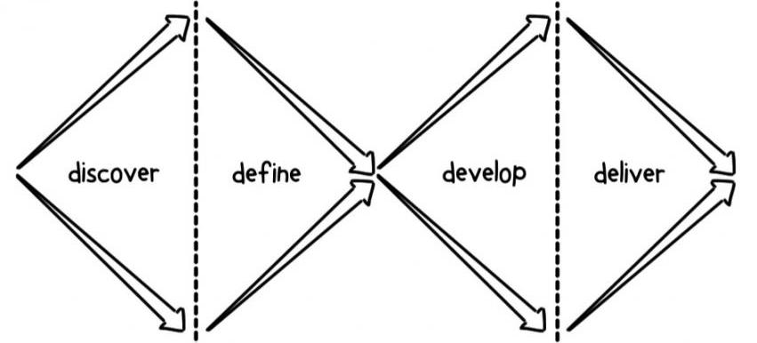

# Co-Design Your Home Page

> Design in groups of 2
>

There will be 2 phases to the project in UX/UI Design, taken from the **Double
Diamond** approach to design:



## Phase 1 / first week: _Design in pairs_

This is the **Discover** & **Define** phase of the Double Diamond design
process. You will take on the role of a UX/UI Designer and you will be
practicing _stakeholder_ and _user interviews_.

Your goal is to design a home page for a client (one of your team members)
that is intuitive, user-friendly, and engaging.

1. Divide your group into pairs and conduct a _stakeholder interview_ with your client
   to help determine what they need from their home page/mobile app.
2. Based on the results of that interview, you will work together to define user
   personas, a backlog, and an initial design in Figma.
3. Using that design your partner will conduct a _user interview_ with each of
   your remaining group mates.
4. Based on the results of the user interviews, your partner will suggest
   changes to the home page's design.
5. Together you will settle on a design.
6. Retrospect
7. Repeat steps 1-6 reversing the roles of the two partners.

## Phase 2 / subsequent weeks: _Develop individually_

> You do not need to finish (or even start) this phase during the UX/UI module!
>
> After you have co-designed your page, you can develop it on your own time
> during the JS modules to continue practicing with HTML/CSS.

This is the **Develop** & **Deliver** phases of the Double Diamond design
process. You will be working individually to build the home page your group
helped design. You are developing your own home page to showcase what you
have learned about HTML & CSS:

1. Practice building a few sections of the page to get a feeling for how the
   design will work.
2. Set technical constraints for yourself. For example, do you want to use a CSS
   framework or stick with plain HTML & CSS?
3. Write a development strategy for yourself
4. Set up your project board & issues
5. Develop
6. Retrospect

You home page is a never-ending project! You can continuously improve it as you
learn more in the coming months. The goal during this module is only to make a
solid start, not to make everything perfect.

## Checklist

Each person in your group will create _their own_ deliverable issue for the
project board, so there should be one issue per person in your class. You can
label it with `individual` and `group`.

To learn more about forking, check out [this video](https://www.youtube.com/watch?v=HbSjyU2vf6Y).

```markdown
# Home Page

- [repo](https://github.com/_/_.github.io)
- [live demo](https://_.github.io)

---

## Design (phase 1)

> you are in the role of a UX/UI Designer
> fork the repo of the client and add a planning folder with the following:

- `/planning`
  - [ ] stakeholder interviews (_the person who's page you are designing_)
  - [ ] user personas
  - [ ] user interviews (_other group members feedback on the design_)
  - [ ] backlog
  - [ ] Figma document
  - [ ] design retrospective

---

## Deliver (phase 2)

> you are in the role of a developer

<!--

  You do not need to start developing during the UX/UI module!

  After the design for your page is finished by your teammate, you can develop it on your own,
  building the page individually during the JS modules to practice HTML & CSS.

-->

- repository
  - [ ] README
  - [ ] License
  - [ ] Contributor Guidelines
  - [ ] Code of Conduct
- `/planning`
  - [ ] constraints
  - [ ] development strategy
  - [ ] delivery retrospective
- [ ] [project board]()
- Accessibility
  - [ ] Web page uses semantic elements
  - [ ] Web page has ARIA labels when necessary
```
